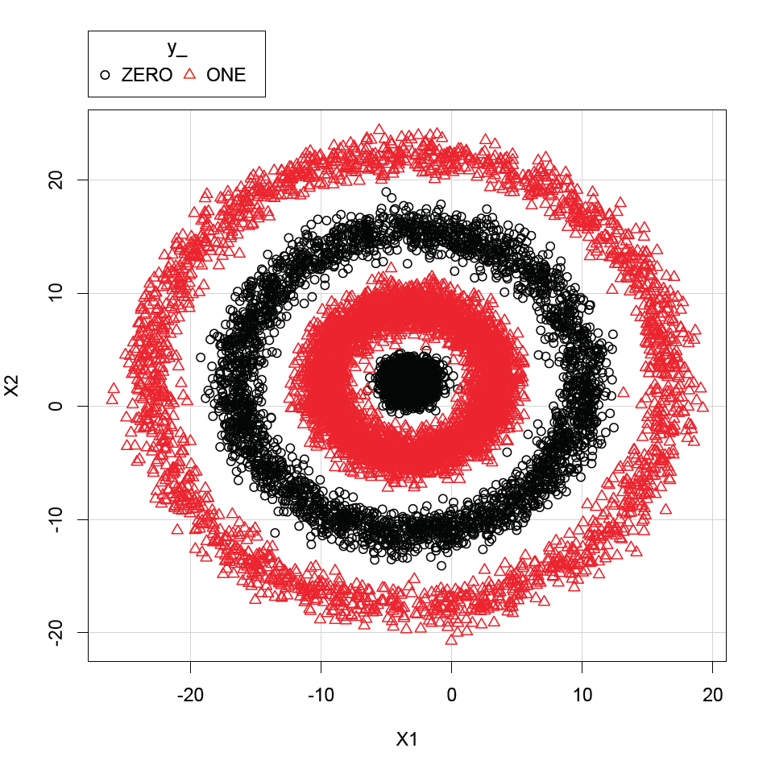

# Erste Kaggle-Competitions

# Kaggle 1: Schnell-mal-klassifizieren

https://www.kaggle.com/c/schnell-mal-klassifizieren

## Vorgehen

### 1. Grafische Analyse der Daten

Plottet man die Trainingswerte (z.B. mit R) so ist schnell eine Art «konzentrische Klassifizierung» ersichtlich. Es könnte
sich beispielsweise um einen 3D-Plot einer Sinus-Welle handeln, wobei die Inputs X1 und X2 jeweils die X- und Y-Koordinaten
repräsentieren, während es sich bei y um bestimmte Abschnitts-Klassen auf der z-Achse handelt. Ein anderer möglicher
 Ursprung könnten schlicht konzentrische Kreise mit einem bestimmten Streuwert sein. Es eignen sich also
sowohl Regressions- als auch Klassifikationsmodelle.

### 2. Evaluation & Fitting von Modellen
Im Python-Script ``classify.py`` werden systematisch verschiedene Klassifikatoren und Regressoren mit dem Trainingsset trainiert
und mit einem einfachen Score, durchschnittlicher Crossvalidation sowie Precision & Recall gemessen.

Der K-Nearest-Neighbors Klassifikator erreicht dabei meist die höchste Punktzahl.

### 3. Mögliche Erweiterung der Daten
Eine Punktzahl von 99.928% ist schon recht hoch. Womöglich könnte das Modell damit verbessert werden, indem die
Daten des Trainingssets erweitert werden. Zum Beispiel durch Rotation & Kopieren. Damit würden die Klassenbereiche
durch zusätzliche Daten besser definiert.

# Kaggle 2: male-FFHS

https://www.kaggle.com/c/male-ffhs

## Vorgehen

### 1. Analyse der Daten
Die Aufgabe und Art der Daten ist bekannt: Handschriftliche Zeichen bestimmten Klassen zuordnen (hier: die Ziffern 1 bis 9).
Es handelt sich also um ein klassisches Klassifikationsproblem.

### 2. Evaluation & Fitting von Modellen
Ein einfaches Fitten von verschiedenen Klassifikatoren mit dem bestehenden Trainingssatz von 20 Bildern bringt uns schon mal
auf eine Kaggle Score von 70%. Immerhin. Die Cross-Validation ist hier auch wenig aussagekräftig. Der Naive Bayes Classifier
scheint hier am besten abzuschneiden (Simple Score 1.0, XVal: 0.87, Prec: 0.88, Rec: 0.85) 

### 3. Erweiterung der Daten
Der recht limitierte Datensatz wird erweitert durch die Bilder der Klasse sowie durch Data Augmentation. Für Letzteres 
werden diverse Bildtransformationen wie z.B. Rotation, Scherung, Skalierung und Kontrasterhöhung zufällig auf die 
bestehenden Bilder appliziert um die Vielfalt zu erhöhen (die Verwendung der Outputs der Hough-Transformation hat – 
wohl aufgrund der geringen Bilddimension – keine wirkliche Verbesserung des Modells gebracht). Mit einem Datensatz 
bestehend aus nun insgesamt beinahe 6000 Bildern erreichen wir mit einem RandomForestClassifier eine 
Cross-Validation-Score von 0.995 bei Precision: 0.994 und Recall: 0.9949. Auf Kaggle erreichen wir damit eine 
Score von 0.99013.

